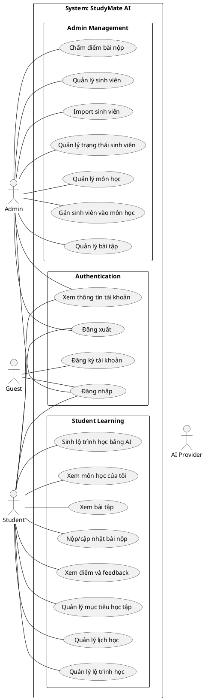
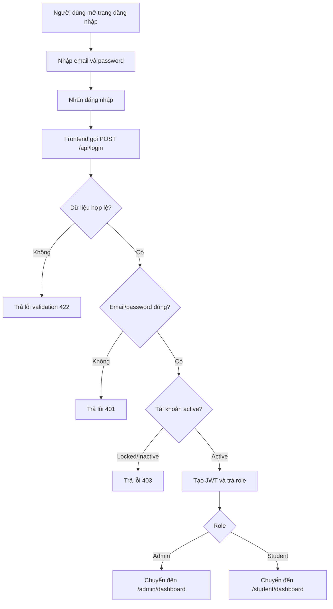
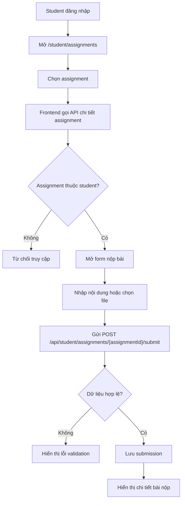
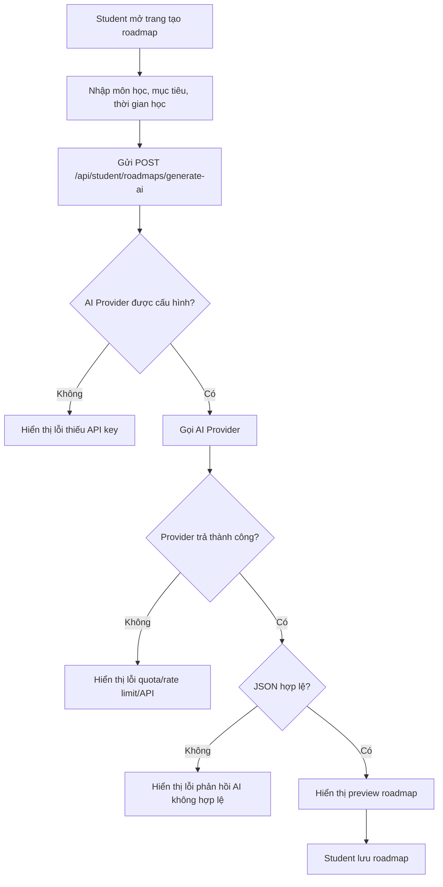
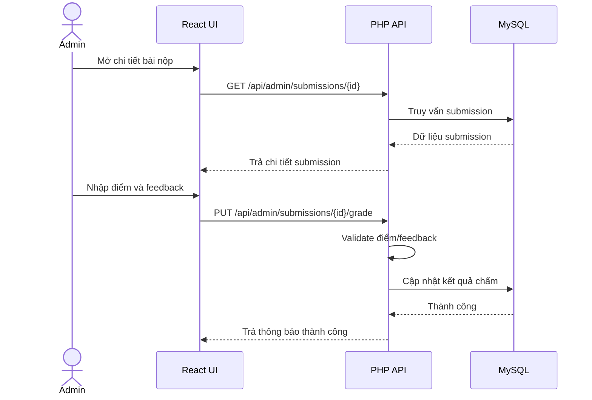

# Diagrams - StudyMate AI

## Rendered Images

Các diagram dưới đây đã được render thành SVG, PNG và XML trong `docs/srs-testing/diagrams/`. File `.xml` là bản XML của SVG diagram, dùng được khi cần nộp hoặc lưu diagram ở dạng XML.

Xem thêm bộ diagram theo từng chức năng tại [by-function-usecases.md](by-function-usecases.md) và [diagrams/by-function/index.md](diagrams/by-function/index.md).

| Diagram | Source | SVG | PNG | XML |
|---|---|---|---|---|
| Use Case Diagram | [use-case-diagram.puml](diagrams/use-case-diagram.puml) | [SVG](diagrams/use-case-diagram.svg) | [PNG](diagrams/use-case-diagram.png) | [XML](diagrams/use-case-diagram.xml) |
| Activity - Đăng nhập | [activity-login.mmd](diagrams/activity-login.mmd) | [SVG](diagrams/activity-login.svg) | [PNG](diagrams/activity-login.png) | [XML](diagrams/activity-login.xml) |
| Activity - Student nộp bài | [activity-submit-assignment.mmd](diagrams/activity-submit-assignment.mmd) | [SVG](diagrams/activity-submit-assignment.svg) | [PNG](diagrams/activity-submit-assignment.png) | [XML](diagrams/activity-submit-assignment.xml) |
| Activity - Tạo roadmap bằng AI | [activity-generate-roadmap-ai.mmd](diagrams/activity-generate-roadmap-ai.mmd) | [SVG](diagrams/activity-generate-roadmap-ai.svg) | [PNG](diagrams/activity-generate-roadmap-ai.png) | [XML](diagrams/activity-generate-roadmap-ai.xml) |
| Sequence - Chấm điểm bài nộp | [sequence-grade-submission.mmd](diagrams/sequence-grade-submission.mmd) | [SVG](diagrams/sequence-grade-submission.svg) | [PNG](diagrams/sequence-grade-submission.png) | [XML](diagrams/sequence-grade-submission.xml) |

## 1. Use Case Diagram - PlantUML

## 2. Activity Diagram - Đăng nhập

## 3. Activity Diagram - Student nộp bài

## 4. Activity Diagram - Tạo roadmap bằng AI

## 5. Sequence Diagram - Chấm điểm bài nộp

