# SRS StudyMate AI v1.0

Tài liệu đặc tả yêu cầu phần mềm dựa trên cấu trúc mẫu SRS_PCM_ver1.1.

## Record of Change

| Effective Date | Changed Items | A/M/D | Change Description | New Version |
|---|---|---|---|---|
| 07/2026 | Toàn bộ tài liệu | A | Tạo SRS StudyMate AI theo format mẫu. | 1.0 |

## Phân tích hệ thống phần mềm

StudyMate AI là website hỗ trợ học tập với backend PHP MVC, frontend React/Vite, JWT authentication, middleware phân quyền và AI Provider tạo roadmap.

## 1. Chức năng đăng ký, đăng nhập và quản lý phiên

**Use-Case ID:** UC_AUTH

**Use-Case Name:** Đăng ký, đăng nhập, xem thông tin tài khoản và đăng xuất

**Brief Description:** Chức năng xác thực là cổng truy cập của StudyMate AI. Hệ thống cho phép người dùng đăng ký tài khoản sinh viên, đăng nhập bằng email và mật khẩu, nhận JWT token, truy cập thông tin tài khoản hiện tại qua /api/me và đăng xuất khỏi giao diện.

**Actor:** Guest, Admin, Student

**Requirement:** FR-AUTH-01 đến FR-AUTH-05; NFR-01, NFR-02

### Flow of Events

Basic Flow:
1. Guest mở màn hình đăng ký hoặc đăng nhập.
2. Với đăng ký, người dùng nhập họ tên, email, mật khẩu, xác nhận mật khẩu, số điện thoại và mã sinh viên nếu có.
3. Hệ thống kiểm tra dữ liệu, kiểm tra email trùng và tạo tài khoản role student ở trạng thái active.
4. Với đăng nhập, người dùng nhập email và mật khẩu.
5. Hệ thống xác thực mật khẩu, kiểm tra trạng thái tài khoản, sinh JWT token và trả redirect_url theo role.
6. Frontend lưu token, gọi /api/me khi cần xác minh phiên và chuyển người dùng đến dashboard phù hợp.
7. Khi đăng xuất, frontend gọi /api/logout, xóa token/session và chuyển về màn hình đăng nhập.

Alternative Flows:
- Email đăng ký đã tồn tại: hệ thống trả 422 và hiển thị lỗi tại trường email.
- Password dưới 6 ký tự hoặc confirm password không khớp: hệ thống không tạo tài khoản.
- Sai email hoặc mật khẩu khi đăng nhập: hệ thống trả 401.
- Tài khoản locked hoặc inactive: hệ thống trả 403.
- Thiếu token ở API cần xác thực: hệ thống trả 401; token sai hoặc hết hạn trả 403.

### Special Requirements
- Mật khẩu phải được hash trước khi lưu.
- JWT payload chứa user_id, email và role.
- Thông tin public user không được trả về password.
- Role admin và student phải được phân quyền qua middleware.

### Pre-Conditions
- Đăng nhập yêu cầu tài khoản tồn tại và active.
- Các API /api/me, /api/logout yêu cầu header Authorization Bearer token hợp lệ.

### Post-Conditions
- Đăng ký thành công tạo user role student.
- Đăng nhập thành công tạo token và điều hướng đúng dashboard.
- Đăng xuất làm sạch phiên phía frontend.

### Interface
| Route/UI | API | Actor | Mô tả |
|---|---|---|---|
| /register | POST /api/register | Guest | Tạo tài khoản student mới. |
| /login | POST /api/login | Guest/Admin/Student | Xác thực và nhận token. |
| App session | GET /api/me | Admin/Student | Lấy thông tin tài khoản hiện tại. |
| Logout button | POST /api/logout | Admin/Student | Kết thúc phiên đăng nhập. |

### Workflows
| Scenario | Actor | System |
|---|---|---|
| Đăng ký | Nhập thông tin đăng ký và nhấn Đăng ký. | Validate, kiểm tra email trùng, tạo tài khoản student. |
| Đăng nhập | Nhập email/password và nhấn Đăng nhập. | Xác thực, tạo JWT, trả role và redirect_url. |
| Kiểm tra phiên | Frontend gửi token. | Trả thông tin public user nếu token hợp lệ. |
| Đăng xuất | Nhấn Đăng xuất. | Trả thành công; frontend xóa token. |

### Screen Description
| No | Field | Control type | Required | Data type | Default | Description |
|---|---|---|---|---|---|---|
| 1 | Họ tên | Text Input | Yes | String | Blank | 3-150 ký tự khi đăng ký. |
| 2 | Email | Text Input | Yes | Email | Blank | Đúng định dạng và không trùng. |
| 3 | Mật khẩu | Password Input | Yes | String | Blank | Tối thiểu 6 ký tự, được hash khi lưu. |
| 4 | Nhập lại mật khẩu | Password Input | Yes | String | Blank | Phải khớp mật khẩu. |
| 5 | Số điện thoại | Text Input | No | String | Blank | Nếu nhập phải đúng pattern điện thoại. |
| 6 | Đăng nhập/Đăng ký | Button | Yes | Action | N/A | Gửi form sau khi dữ liệu hợp lệ. |

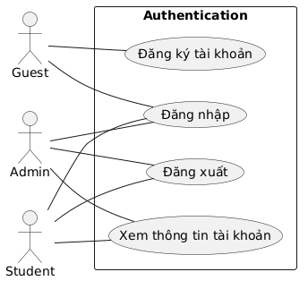

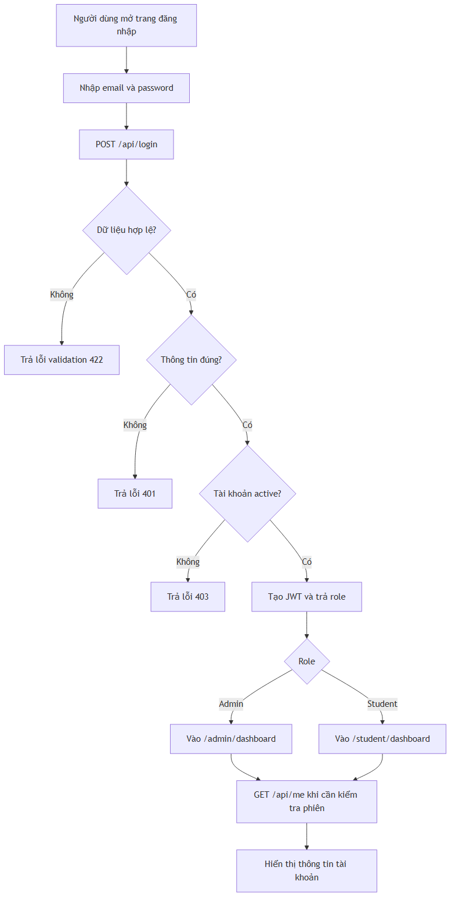

## 2. Chức năng bảng điều khiển

**Use-Case ID:** UC_DASHBOARD

**Use-Case Name:** Xem dashboard theo vai trò

**Brief Description:** Dashboard là trang đầu sau khi đăng nhập, hiển thị không gian làm việc riêng cho Admin hoặc Student. Admin xem tổng quan quản trị; Student xem khu vực học tập cá nhân và các lối tắt đến môn học, bài tập, điểm, mục tiêu, lịch học và lộ trình.

**Actor:** Admin, Student

**Requirement:** FR-AUTH-02, FR-AUTH-04, NFR-02

### Flow of Events

Basic Flow:
1. Người dùng đăng nhập thành công.
2. Hệ thống xác định role từ token/user data.
3. Nếu role là admin, hệ thống chuyển đến /admin/dashboard và hiển thị menu quản trị.
4. Nếu role là student, hệ thống chuyển đến /student/dashboard hoặc /dashboard và hiển thị menu học tập.
5. Người dùng chọn một menu để đi đến module tương ứng.

Alternative Flows:
- User chưa đăng nhập truy cập dashboard: hệ thống chuyển về /login hoặc trả lỗi auth.
- Student truy cập route admin: RoleMiddleware trả 403.
- Admin truy cập route student cá nhân: hệ thống cần kiểm soát quyền và dữ liệu theo role.

### Special Requirements
- Menu hiển thị phải phù hợp với role.
- Các menu placeholder như Lessons, Quiz, Tasks, Notes, AI Assistant, Progress phải được đánh dấu chưa hoàn thiện nếu chưa có API nghiệp vụ tương ứng.

### Pre-Conditions
- Người dùng đã đăng nhập và token hợp lệ.

### Post-Conditions
- Dashboard hiển thị đúng vai trò và điều hướng đúng module.

### Interface
| Route/UI | API | Actor | Mô tả |
|---|---|---|---|
| /admin/dashboard | GET /api/admin/dashboard | Admin | Dashboard quản trị. |
| /student/dashboard | GET /api/student/dashboard | Student | Dashboard sinh viên. |
| Sidebar/Menu | Client route | Admin/Student | Điều hướng chức năng theo vai trò. |

### Workflows
| Scenario | Actor | System |
|---|---|---|
| Truy cập dashboard | Đăng nhập thành công. | Điều hướng theo role. |
| Chọn menu | Nhấn Sinh viên/Môn học/Bài tập... | Mở module tương ứng. |
| Truy cập trái quyền | Student mở admin route. | Từ chối 403. |

### Screen Description
| No | Field | Control type | Required | Data type | Default | Description |
|---|---|---|---|---|---|---|
| 1 | Brand/User info | Read-only | N/A | Object | Current user | Hiển thị họ tên, email, role. |
| 2 | Admin menu | Navigation | N/A | Route | N/A | Dashboard, Sinh viên, Môn học, Bài tập, Thống kê... |
| 3 | Student menu | Navigation | N/A | Route | N/A | Môn học của tôi, Bài tập, Điểm, Mục tiêu, Lịch, Roadmap... |
| 4 | Đăng xuất | Button | Yes | Action | N/A | Gọi logout và xóa session. |

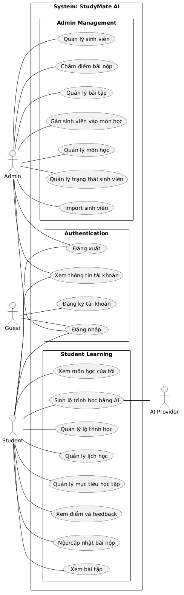

## 3. Chức năng quản lý sinh viên

**Use-Case ID:** UC_STUDENT_MANAGEMENT

**Use-Case Name:** Quản lý hồ sơ và trạng thái sinh viên

**Brief Description:** Chức năng quản lý sinh viên cho phép Admin xem danh sách, tìm kiếm/lọc, xem chi tiết, tạo mới, cập nhật, xóa hoặc vô hiệu hóa sinh viên, import danh sách từ file và reset mật khẩu.

**Actor:** Admin

**Requirement:** FR-STU-01 đến FR-STU-05

### Flow of Events

Basic Flow:
1. Admin mở màn hình /admin/students.
2. Hệ thống tải danh sách sinh viên với phân trang, keyword và status filter.
3. Admin tạo hoặc cập nhật sinh viên bằng form.
4. Hệ thống validate họ tên, email, phone, mã sinh viên, status và uniqueness.
5. Admin có thể disable, enable, lock hoặc reset password sinh viên.
6. Admin có thể import sinh viên từ file CSV/XLS/XLSX theo template.

Alternative Flows:
- Email hoặc student_code trùng: trả 422.
- Mã sinh viên chứa ký tự không hợp lệ hoặc emoji: trả lỗi validation.
- File import không đúng định dạng hoặc quá 5MB: trả lỗi file.
- Reset password dưới 6 ký tự: trả lỗi new_password.
- Xóa sinh viên đã có dữ liệu học tập: hệ thống chuyển trạng thái inactive thay vì xóa cứng.

### Special Requirements
- Chỉ Admin được truy cập route /api/admin/students.
- Email và student_code phải duy nhất.
- Status chỉ nhận active, inactive, locked.

### Pre-Conditions
- Admin đã đăng nhập và có token hợp lệ.

### Post-Conditions
- Dữ liệu sinh viên được cập nhật đúng; trạng thái ảnh hưởng trực tiếp đến khả năng đăng nhập.

### Interface
| Route/UI | API | Actor | Mô tả |
|---|---|---|---|
| /admin/students | GET /api/admin/students | Admin | Danh sách sinh viên. |
| /admin/students/create | POST /api/admin/students | Admin | Tạo sinh viên. |
| /admin/students/{id}/edit | PUT /api/admin/students/{id} | Admin | Cập nhật sinh viên. |
| /admin/students/import | POST /api/admin/students/import | Admin | Import từ file. |
| Status actions | PUT disable/enable/lock/reset-password | Admin | Quản lý trạng thái và mật khẩu. |

### Workflows
| Scenario | Actor | System |
|---|---|---|
| Xem danh sách | Mở trang sinh viên. | Trả danh sách và pagination. |
| Tạo/cập nhật | Nhập thông tin và lưu. | Validate, lưu DB, trả dữ liệu mới. |
| Import | Chọn file template. | Kiểm tra file, import, trả summary/errors. |
| Reset mật khẩu | Nhập mật khẩu mới hoặc để trống. | Dùng mật khẩu mới hoặc student_code làm mặc định. |

### Screen Description
| No | Field | Control type | Required | Data type | Default | Description |
|---|---|---|---|---|---|---|
| 1 | Họ tên | Text Input | Yes | String | Blank | 3-150 ký tự. |
| 2 | Email | Text Input | Yes | Email | Blank | Đúng định dạng, không trùng. |
| 3 | Số điện thoại | Text Input | No | String | Blank | Pattern điện thoại hợp lệ. |
| 4 | Mã sinh viên | Text Input | Yes | String | Blank | Tối đa 50 ký tự, chữ và số. |
| 5 | Trạng thái | Dropdown | Yes | Enum | active | active, inactive, locked. |
| 6 | File import | File Input | Yes | File | Blank | CSV, XLS, XLSX; tối đa 5MB. |

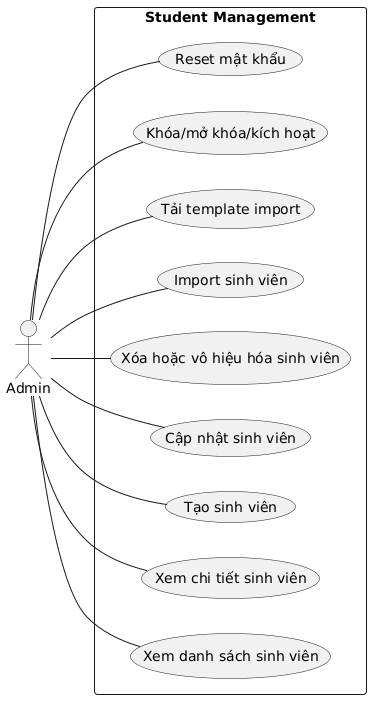

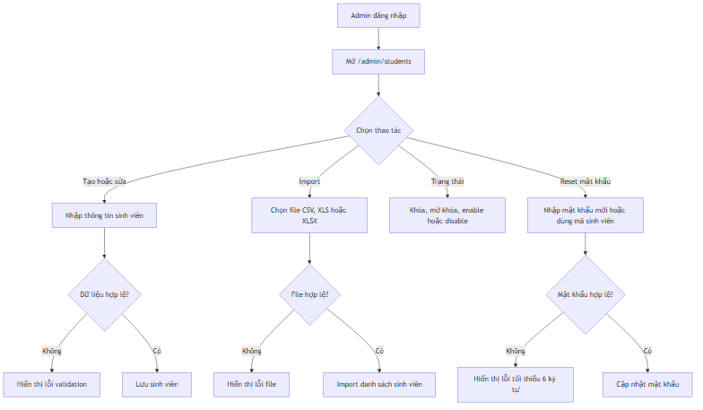

## 4. Chức năng quản lý môn học và phân công sinh viên

**Use-Case ID:** UC_SUBJECT_MANAGEMENT

**Use-Case Name:** Quản lý môn học và gán sinh viên vào môn

**Brief Description:** Chức năng môn học cho phép Admin CRUD môn học, tải ảnh đại diện, quản lý sinh viên được gán vào từng môn. Student chỉ xem danh sách và chi tiết môn học thuộc tài khoản của mình.

**Actor:** Admin, Student

**Requirement:** FR-SUB-01 đến FR-SUB-05

### Flow of Events

Basic Flow:
1. Admin mở danh sách môn học.
2. Admin tạo, sửa hoặc xóa môn học.
3. Hệ thống validate tên môn, mã môn, tín chỉ, trạng thái, màu và ảnh.
4. Admin mở danh sách sinh viên trong môn, xem sinh viên khả dụng và gán sinh viên.
5. Student mở Môn học của tôi để xem các môn đã được gán.

Alternative Flows:
- Mã môn sai định dạng hoặc trùng: trả lỗi validation.
- Ảnh sai định dạng, MIME không hợp lệ hoặc quá 2MB: trả lỗi image.
- Gán trùng sinh viên vào cùng môn: trả 409.
- Student xem môn chưa được gán: trả 403.

### Special Requirements
- Không được sửa subject_code khi update.
- Credits chỉ nhận số nguyên 1-30.
- Status môn học gồm studying, paused, completed.

### Pre-Conditions
- Admin hoặc Student đã đăng nhập; subject/student tồn tại khi thao tác gán.

### Post-Conditions
- Môn học được lưu; quan hệ student-subject được cập nhật; Student chỉ thấy môn của mình.

### Interface
| Route/UI | API | Actor | Mô tả |
|---|---|---|---|
| /admin/subjects | GET/POST /api/subjects | Admin | Danh sách và tạo môn. |
| /admin/subjects/{id}/edit | PUT/POST /api/subjects/{id} | Admin | Cập nhật môn học. |
| /admin/subjects/{subjectId}/students | GET/POST/DELETE /api/admin/subjects/{subjectId}/students | Admin | Gán/gỡ sinh viên. |
| /student/my-subjects | GET /api/student/my-subjects | Student | Môn học của tôi. |

### Workflows
| Scenario | Actor | System |
|---|---|---|
| CRUD môn học | Admin nhập thông tin môn. | Validate và lưu dữ liệu. |
| Gán sinh viên | Admin chọn sinh viên khả dụng. | Kiểm tra trùng và tạo assignment. |
| Gỡ sinh viên | Admin chọn sinh viên đang gán. | Xóa quan hệ nếu tồn tại. |
| Student xem môn | Student mở My Subjects. | Chỉ trả môn active được gán. |

### Screen Description
| No | Field | Control type | Required | Data type | Default | Description |
|---|---|---|---|---|---|---|
| 1 | Mã môn học | Text Input | Yes | String | Blank | Tối đa 50 ký tự, chữ/số/gạch ngang/gạch dưới; không sửa khi update. |
| 2 | Tên môn học | Text Input | Yes | String | Blank | Tối đa 255 ký tự. |
| 3 | Tín chỉ | Number Input | Yes | Integer | 3 | Từ 1 đến 30. |
| 4 | Trạng thái | Dropdown | Yes | Enum | studying | studying, paused, completed. |
| 5 | Màu đại diện | Color Input | No | Hex | Blank | Mã màu #RGB hoặc #RRGGBB. |
| 6 | Ảnh môn học | File Input | No | Image | Blank | jpg, jpeg, png, webp, gif; tối đa 2MB. |

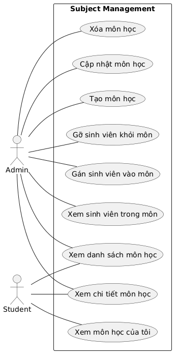

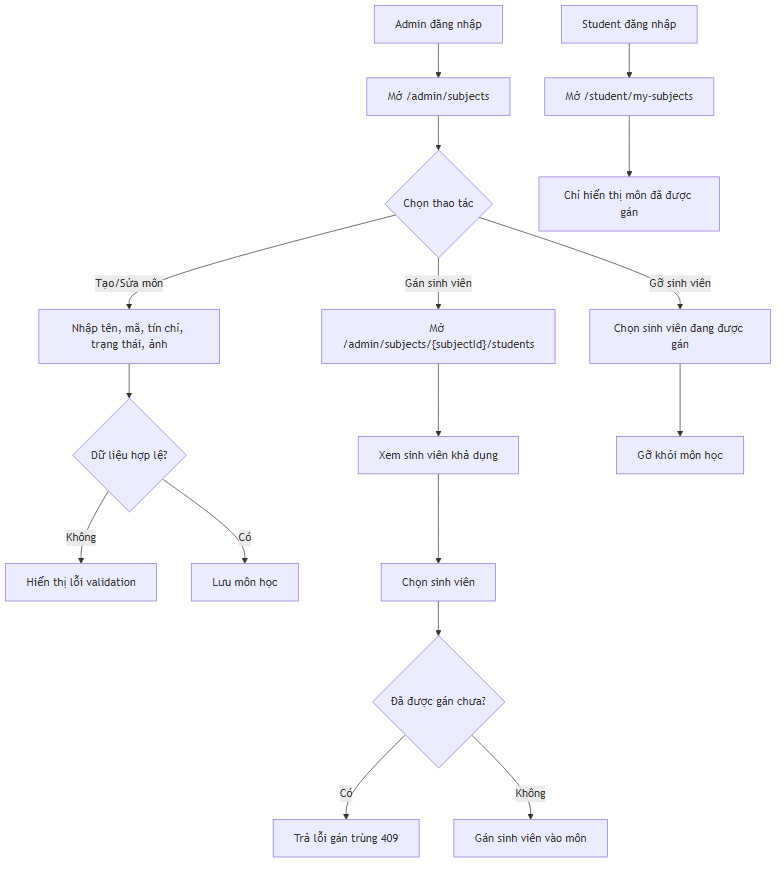

## 5. Chức năng quản lý bài tập, bài nộp và chấm điểm

**Use-Case ID:** UC_ASSIGNMENT_GRADING

**Use-Case Name:** Quản lý bài tập, nộp bài, điểm và feedback

**Brief Description:** Phân hệ bài tập kết nối hoạt động của Admin và Student: Admin tạo bài tập theo môn, Student xem bài tập được giao và nộp bài, Admin xem submission và chấm điểm, Student xem điểm và feedback.

**Actor:** Admin, Student

**Requirement:** FR-ASG-01, FR-ASG-02, FR-SUBM-01, FR-SUBM-02, FR-GRD-01 đến FR-GRD-03

### Flow of Events

Basic Flow:
1. Admin tạo bài tập với subject, title, description, deadline, status và file đính kèm nếu có.
2. Hệ thống validate subject tồn tại, title, deadline, status và file.
3. Student xem danh sách bài tập thuộc môn học của mình.
4. Student nộp bài bằng nội dung hoặc file.
5. Admin xem bài nộp theo assignment, mở chi tiết submission và nhập điểm/feedback.
6. Student xem điểm và feedback của chính mình.

Alternative Flows:
- Assignment open có deadline quá khứ: trả lỗi deadline.
- File assignment/submission sai định dạng hoặc quá 10MB: trả lỗi file.
- Student nộp bài trống cả content và file: trả 422.
- Score không phải số hoặc ngoài 0-10: trả lỗi score.
- Student truy cập assignment/submission không thuộc mình: trả 403 hoặc 404.

### Special Requirements
- Assignment status chỉ gồm draft, open, closed.
- Submission late được xác định theo deadline.
- Feedback tối đa 5000 ký tự.

### Pre-Conditions
- Admin/Student đã đăng nhập; Student phải được gán vào môn chứa assignment.

### Post-Conditions
- Bài tập/submission/grade được lưu và hiển thị đúng cho actor có quyền.

### Interface
| Route/UI | API | Actor | Mô tả |
|---|---|---|---|
| /admin/assignments | GET/POST /api/admin/assignments | Admin | Danh sách và tạo bài tập. |
| /admin/assignments/{id}/edit | PUT/POST /api/admin/assignments/{id} | Admin | Cập nhật bài tập. |
| /student/assignments | GET /api/student/assignments | Student | Bài tập được giao. |
| /student/assignments/{assignmentId}/submit | POST /api/student/assignments/{assignmentId}/submit | Student | Nộp bài. |
| /admin/submissions/{id} | PUT /api/admin/submissions/{id}/grade | Admin | Chấm điểm. |

### Workflows
| Scenario | Actor | System |
|---|---|---|
| Tạo bài tập | Admin nhập form. | Validate và lưu assignment. |
| Nộp bài | Student nhập content/file. | Kiểm tra quyền, validate và lưu submission. |
| Chấm điểm | Admin nhập score/feedback. | Validate và cập nhật grade. |
| Xem điểm | Student mở grades. | Chỉ trả điểm của student hiện tại. |

### Screen Description
| No | Field | Control type | Required | Data type | Default | Description |
|---|---|---|---|---|---|---|
| 1 | Môn học | Dropdown | Yes | Integer | Blank | Subject phải tồn tại. |
| 2 | Tiêu đề bài tập | Text Input | Yes | String | Blank | Tối đa 255 ký tự. |
| 3 | Deadline | DateTime Input | Yes | DateTime | Blank | Nếu status open phải ở tương lai. |
| 4 | Trạng thái | Dropdown | Yes | Enum | draft | draft, open, closed. |
| 5 | File đính kèm | File Input | No | File | Blank | pdf/doc/docx/zip/rar/png/jpg/jpeg; tối đa 10MB. |
| 6 | Nội dung bài nộp | Textarea | Conditional | String | Blank | Bắt buộc nếu không upload file. |
| 7 | Điểm | Number Input | Yes | Float | Blank | Từ 0 đến 10. |
| 8 | Feedback | Textarea | No | String | Blank | Tối đa 5000 ký tự. |

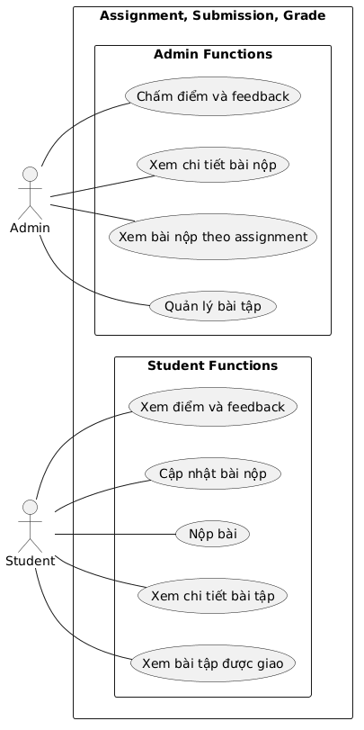

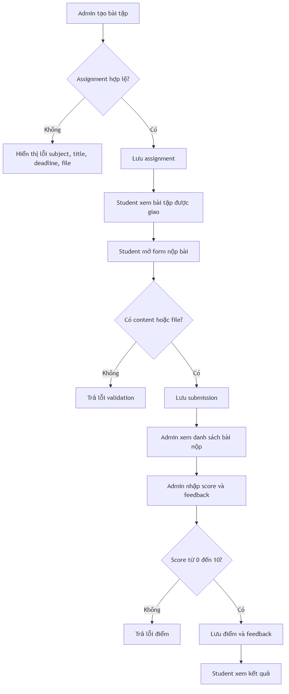

## 6. Chức năng quản lý mục tiêu học tập

**Use-Case ID:** UC_LEARNING_GOAL

**Use-Case Name:** Quản lý mục tiêu học tập cá nhân

**Brief Description:** Chức năng mục tiêu học tập cho phép Student tạo và theo dõi các mục tiêu học tập cá nhân. Dữ liệu được giới hạn theo tài khoản student hiện tại.

**Actor:** Student

**Requirement:** FR-GOAL-01

### Flow of Events

Basic Flow:
1. Student mở danh sách mục tiêu học tập.
2. Student tạo mục tiêu mới bằng form.
3. Student xem chi tiết, cập nhật hoặc xóa mục tiêu.
4. Hệ thống chỉ thao tác trên mục tiêu thuộc user hiện tại.

Alternative Flows:
- Thiếu trường bắt buộc hoặc dữ liệu sai định dạng: hiển thị lỗi validation.
- Student truy cập mục tiêu không thuộc mình: trả lỗi không tìm thấy hoặc không có quyền.

### Special Requirements
- Dữ liệu mục tiêu là dữ liệu cá nhân, cần phân tách theo user_id.

### Pre-Conditions
- Student đã đăng nhập.

### Post-Conditions
- Mục tiêu được tạo/cập nhật/xóa và danh sách phản ánh trạng thái mới.

### Interface
| Route/UI | API | Actor | Mô tả |
|---|---|---|---|
| /student/learning-goals | GET /api/student/learning-goals | Student | Danh sách mục tiêu. |
| /student/learning-goals/create | POST /api/student/learning-goals | Student | Tạo mục tiêu. |
| /student/learning-goals/{id}/edit | PUT /api/student/learning-goals/{id} | Student | Cập nhật mục tiêu. |
| Delete action | DELETE /api/student/learning-goals/{id} | Student | Xóa mục tiêu. |

### Workflows
| Scenario | Actor | System |
|---|---|---|
| Tạo mục tiêu | Student nhập form. | Validate và lưu goal. |
| Cập nhật | Student chỉnh sửa goal. | Validate quyền và cập nhật. |
| Xóa | Student xác nhận xóa. | Xóa goal thuộc user hiện tại. |

### Screen Description
| No | Field | Control type | Required | Data type | Default | Description |
|---|---|---|---|---|---|---|
| 1 | Tiêu đề mục tiêu | Text Input | Yes | String | Blank | Tên mục tiêu học tập. |
| 2 | Môn học | Dropdown | No | Integer | Blank | Liên kết mục tiêu với môn học nếu có. |
| 3 | Mô tả | Textarea | No | String | Blank | Mô tả mục tiêu và phạm vi học. |
| 4 | Trạng thái/Tiến độ | Dropdown/Input | No | Enum/Number | N/A | Theo dõi mức hoàn thành nếu UI cung cấp. |

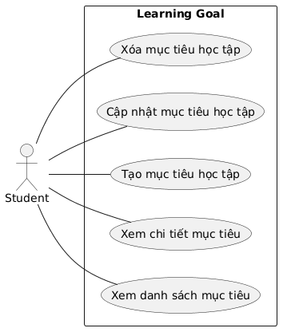

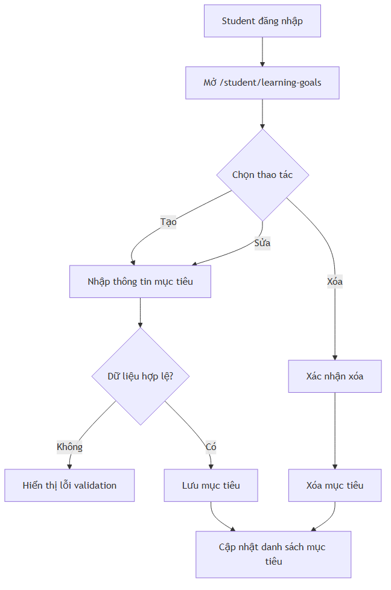

## 7. Chức năng quản lý lịch học

**Use-Case ID:** UC_STUDY_SCHEDULE

**Use-Case Name:** Quản lý lịch học cá nhân

**Brief Description:** Chức năng lịch học cho phép Student tạo, xem, cập nhật và xóa lịch tự học, lịch lớp, ôn tập, bài tập hoặc thi. Hệ thống kiểm soát ngày giờ và trạng thái để tránh lịch không hợp lệ.

**Actor:** Student

**Requirement:** FR-SCH-01

### Flow of Events

Basic Flow:
1. Student mở calendar/list lịch học.
2. Student tạo lịch với môn học, tiêu đề, ngày học, giờ bắt đầu, giờ kết thúc, loại lịch và trạng thái.
3. Hệ thống validate ngày giờ, loại lịch, trạng thái và lưu lịch.
4. Student cập nhật hoặc xóa lịch học của mình.

Alternative Flows:
- end_time nhỏ hơn hoặc bằng start_time: trả lỗi end_time.
- study_date sai định dạng: trả lỗi study_date.
- Tạo lịch upcoming ở quá khứ: trả lỗi study_date.
- Đánh dấu completed cho lịch trong tương lai: trả lỗi status.

### Special Requirements
- schedule_type gồm class, self_study, review, assignment, exam.
- status gồm upcoming, completed, cancelled.
- Roadmap có thể tự tạo lịch học cho từng roadmap item.

### Pre-Conditions
- Student đã đăng nhập; subject hợp lệ nếu lịch gắn với môn học.

### Post-Conditions
- Lịch học được lưu và hiển thị trên calendar/list theo user hiện tại.

### Interface
| Route/UI | API | Actor | Mô tả |
|---|---|---|---|
| /student/schedules | GET /api/study-schedules | Student | Danh sách/calendar lịch học. |
| /student/schedules/create | POST /api/study-schedules | Student | Tạo lịch học. |
| /student/schedules/{id}/edit | PUT /api/study-schedules/{id} | Student | Cập nhật lịch học. |
| Delete action | DELETE /api/study-schedules/{id} | Student | Xóa lịch học. |

### Workflows
| Scenario | Actor | System |
|---|---|---|
| Tạo lịch | Student nhập thông tin lịch. | Validate ngày giờ, loại lịch, trạng thái và lưu. |
| Cập nhật lịch | Student chỉnh sửa lịch. | Validate quyền và cập nhật. |
| Xóa lịch | Student xác nhận xóa. | Xóa lịch thuộc user hiện tại. |

### Screen Description
| No | Field | Control type | Required | Data type | Default | Description |
|---|---|---|---|---|---|---|
| 1 | Môn học | Dropdown | Yes | Integer | Blank | Subject ID hợp lệ. |
| 2 | Tiêu đề lịch | Text Input | Yes | String | Blank | Tối đa 255 ký tự. |
| 3 | Ngày học | Date Input | Yes | Date | Blank | YYYY-MM-DD. |
| 4 | Giờ bắt đầu | Time Input | Yes | Time | Blank | HH:mm. |
| 5 | Giờ kết thúc | Time Input | Yes | Time | Blank | Phải lớn hơn giờ bắt đầu. |
| 6 | Loại lịch | Dropdown | Yes | Enum | self_study | class, self_study, review, assignment, exam. |
| 7 | Trạng thái | Dropdown | Yes | Enum | upcoming | upcoming, completed, cancelled. |

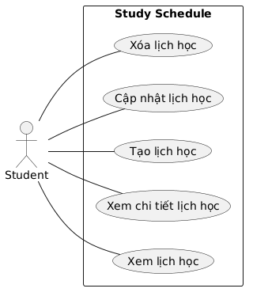

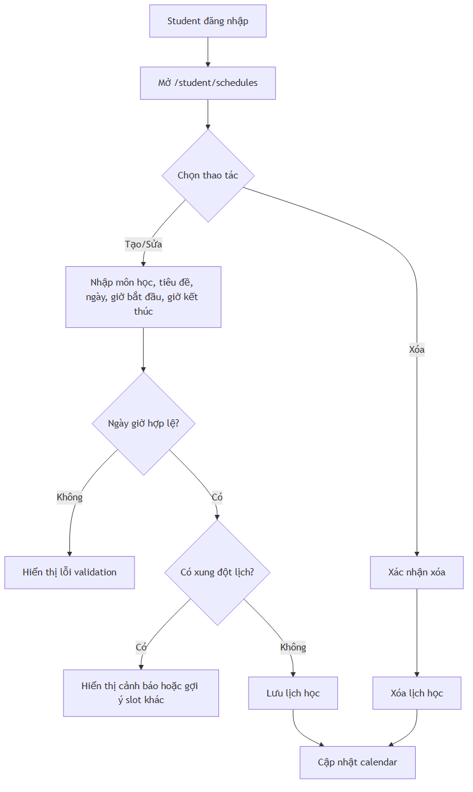

## 8. Chức năng quản lý lộ trình học và AI Roadmap

**Use-Case ID:** UC_LEARNING_ROADMAP

**Use-Case Name:** Tạo và theo dõi lộ trình học cá nhân hóa

**Brief Description:** Chức năng lộ trình học cho phép Student tạo roadmap thủ công hoặc sinh roadmap bằng AI dựa trên môn học, mục tiêu, trình độ, thời gian học và ngày học khả dụng. Hệ thống lưu roadmap, tạo item, cập nhật trạng thái/kết quả và tính tiến độ.

**Actor:** Student, AI Provider

**Requirement:** FR-RM-01 đến FR-RM-03; NFR-04

### Flow of Events

Basic Flow:
1. Student mở danh sách roadmap.
2. Student chọn tạo roadmap thủ công hoặc tạo bằng AI.
3. Student nhập subject, goal, current_level, study_time_per_day, available_weekdays, preferred_start_time, session_duration, start_date và end_date.
4. Nếu tạo bằng AI, hệ thống gọi provider OpenAI/Gemini đã cấu hình và yêu cầu response JSON.
5. Hệ thống hiển thị preview hoặc lưu roadmap cùng các item.
6. Student cập nhật trạng thái, kết quả, thời lượng học thực tế hoặc dời lịch item.
7. Hệ thống cập nhật progress theo ngày/tuần/toàn roadmap.

Alternative Flows:
- Thiếu API key hoặc provider bị lock do quota/rate limit: hiển thị lỗi rõ ràng, không làm sập hệ thống.
- AI trả JSON không hợp lệ hoặc không có items: trả lỗi tạo roadmap.
- end_date nhỏ hơn start_date hoặc không chọn weekday: trả lỗi validation.
- Item trùng lịch học hiện có: hệ thống trả danh sách conflict và gợi ý slot khác nếu có.

### Special Requirements
- current_level gồm beginner, intermediate, advanced.
- available_weekdays là danh sách số 1-7.
- session_duration_minutes tối thiểu 15 phút.
- Roadmap status gồm draft, active, completed, paused.
- Item status gồm not_started, in_progress, completed, not_completed, rescheduled.

### Pre-Conditions
- Student đã đăng nhập; subject phải thuộc danh sách môn được gán cho student.

### Post-Conditions
- Roadmap và items được lưu; lịch học liên quan có thể được tạo; tiến độ được tính lại sau mỗi cập nhật item.

### Interface
| Route/UI | API | Actor | Mô tả |
|---|---|---|---|
| /student/roadmaps | GET /api/student/roadmaps | Student | Danh sách roadmap. |
| /student/roadmaps/generate | POST /api/student/roadmaps/generate-ai | Student | Sinh roadmap bằng AI. |
| /student/roadmaps | POST /api/student/roadmaps | Student | Lưu roadmap. |
| /student/roadmaps/{id} | GET/PUT/DELETE /api/student/roadmaps/{id} | Student | Chi tiết, cập nhật, xóa roadmap. |
| Roadmap item actions | PUT /api/student/roadmap-items/{id}/status|result|schedule | Student | Cập nhật item. |

### Workflows
| Scenario | Actor | System |
|---|---|---|
| Tạo AI roadmap | Student nhập form tạo AI. | Validate input, gọi AI Provider, kiểm tra JSON và trả preview. |
| Lưu roadmap | Student xác nhận lưu. | Validate items, kiểm tra conflict lịch và lưu DB. |
| Cập nhật item | Student cập nhật status/result/schedule. | Lưu item và tính lại progress. |
| Lỗi provider | AI Provider lỗi hoặc hết quota. | Trả thông báo cấu hình/quota/rate limit thân thiện. |

### Screen Description
| No | Field | Control type | Required | Data type | Default | Description |
|---|---|---|---|---|---|---|
| 1 | Môn học | Dropdown | Yes | Integer | Blank | Subject thuộc student. |
| 2 | Mục tiêu | Textarea | Yes | String | Blank | Mục tiêu học tập. |
| 3 | Trình độ | Dropdown | Yes | Enum | beginner | beginner, intermediate, advanced. |
| 4 | Thời gian học mỗi ngày | Number Input | Yes | Float | Blank | Phải lớn hơn 0. |
| 5 | Ngày có thể học | Checkbox group | Yes | Array | Blank | Chọn ít nhất một ngày 1-7. |
| 6 | Giờ bắt đầu ưu tiên | Time Input | Yes | Time | Blank | HH:mm. |
| 7 | Thời lượng mỗi buổi | Number Input | Yes | Integer | 60 | Tối thiểu 15 phút. |
| 8 | Ngày bắt đầu/kết thúc | Date Input | Yes | Date | Blank | end_date >= start_date. |
| 9 | Generate AI | Button | Conditional | Action | N/A | Gọi AI Provider và nhận JSON roadmap. |

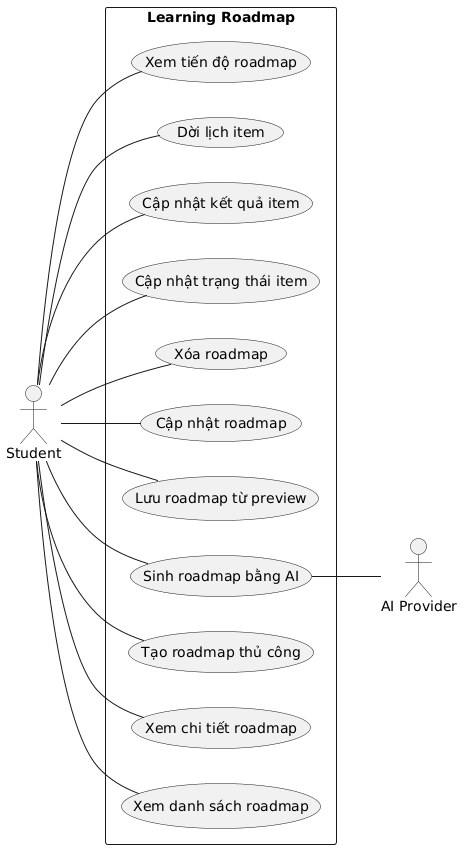

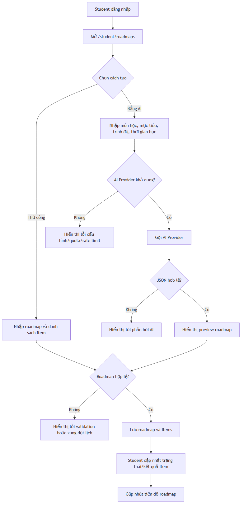

## 9. Các chức năng hiển thị placeholder/chưa hoàn thiện

**Use-Case ID:** UC_PLACEHOLDER_MODULES

**Use-Case Name:** Bài học, Quiz, Nhiệm vụ, Ghi chú, AI Assistant tổng quát và Tiến độ

**Brief Description:** Một số mục xuất hiện trong menu frontend nhưng source được phân tích chưa có API nghiệp vụ hoàn chỉnh tương ứng. Các mục này cần được ghi nhận trong SRS để tránh nhầm lẫn phạm vi kiểm thử.

**Actor:** Admin, Student

**Requirement:** Out of current implemented scope

### Flow of Events

Basic Flow:
1. Người dùng chọn menu placeholder.
2. Frontend hiển thị màn hình thông báo chức năng đang được chuẩn bị hoặc khu vực chưa hoàn thiện.
3. Hệ thống không thực hiện thao tác nghiệp vụ ghi dữ liệu nếu chưa có API tương ứng.

Alternative Flows:
- Nếu người dùng kỳ vọng thao tác nghiệp vụ, hệ thống cần hiển thị thông báo rõ rằng chức năng chưa hoàn thiện.
- Tester không nên viết test case pass/fail nghiệp vụ sâu cho module chưa có implementation.

### Special Requirements
- Các module này cần được tách thành yêu cầu phát triển tương lai.
- Khi API được bổ sung, SRS và traceability matrix phải cập nhật lại.

### Pre-Conditions
- Người dùng đã đăng nhập nếu menu nằm trong vùng dashboard.

### Post-Conditions
- Người dùng nhìn thấy placeholder, không có dữ liệu nghiệp vụ mới được tạo.

### Interface
| Route/UI | API | Actor | Mô tả |
|---|---|---|---|
| /admin/lessons | N/A | Admin | Placeholder quản lý bài học. |
| /admin/quizzes | N/A | Admin | Placeholder quản lý quiz. |
| /tasks | N/A | Student | Placeholder nhiệm vụ học tập. |
| /notes | N/A | Student | Placeholder ghi chú. |
| /assistant | N/A | Student | Placeholder AI Assistant tổng quát. |
| /progress | N/A | Student | Placeholder tiến độ học tập. |

### Workflows
| Scenario | Actor | System |
|---|---|---|
| Mở placeholder | Người dùng chọn menu. | Hiển thị màn hình placeholder. |
| Kiểm thử phạm vi | Tester rà soát API. | Đánh dấu chưa đủ scope để kiểm thử nghiệp vụ. |

### Screen Description
| No | Field | Control type | Required | Data type | Default | Description |
|---|---|---|---|---|---|---|
| 1 | Tiêu đề module | Read-only | N/A | String | N/A | Tên chức năng đang chuẩn bị. |
| 2 | Mô tả | Read-only | N/A | String | N/A | Thông báo phạm vi chức năng. |
| 3 | Quay lại dashboard | Button/Link | No | Action | N/A | Điều hướng về dashboard. |
